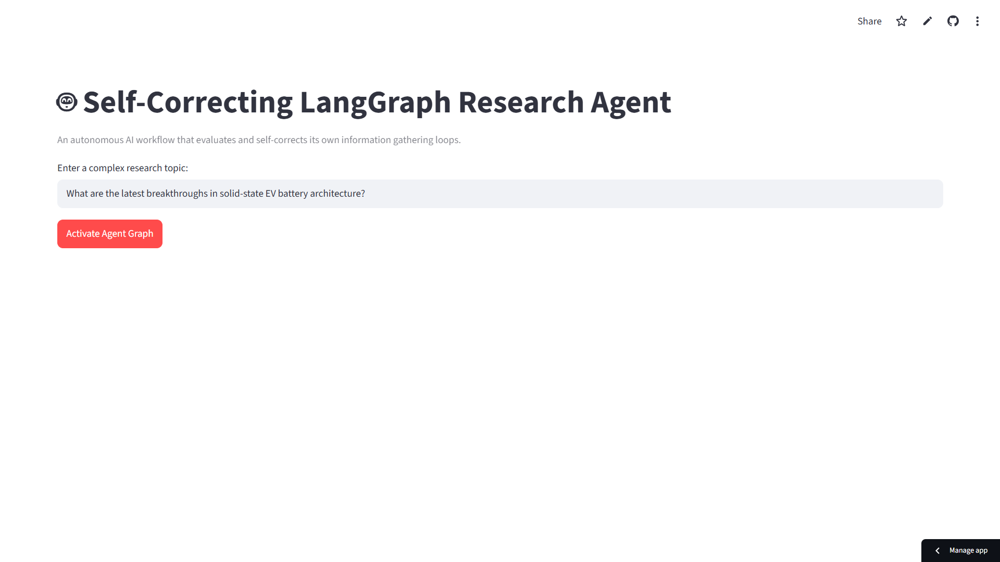
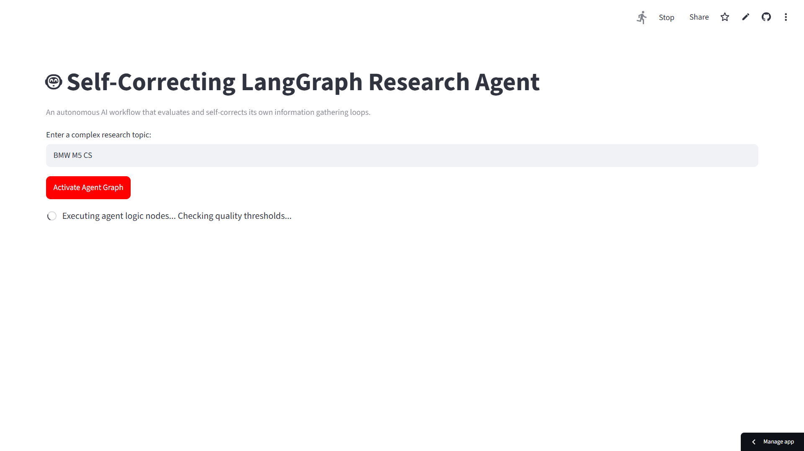
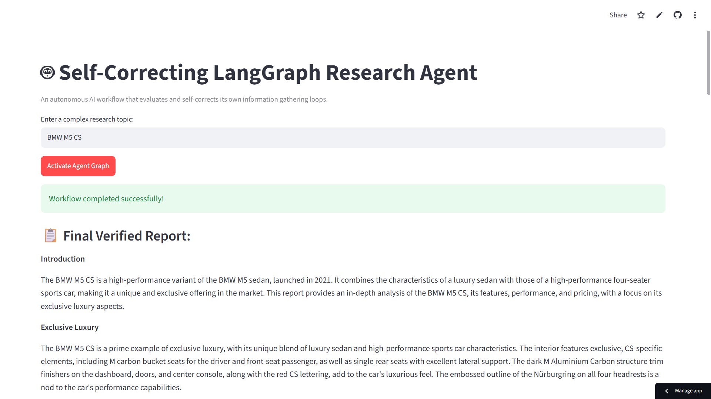
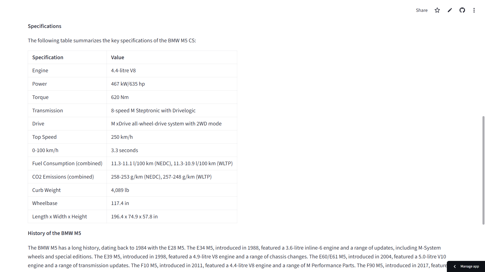

# 🤖 Self-Correcting AI Research Agent

An autonomous AI research assistant built using **LangGraph** that performs web research, generates structured reports, evaluates its own output, and improves the report through a self-correcting workflow before presenting the final result.

🌐 **Live Demo:** https://tejas-ai-agent.streamlit.app/

---

## 📸 Application Preview



---

## 🚀 Features

- 🔍 Performs autonomous web research using **Tavily AI Search**
- ✍️ Generates structured research reports using **Llama 3.3 (Groq)**
- ✅ Implements a self-correcting evaluation loop using **LangGraph**
- 🔄 Re-runs the research workflow when report quality is below the required threshold
- 🌐 Interactive web interface built with **Streamlit**

---

## ⚙️ Agent Execution

The agent researches the given topic, evaluates the generated report, and automatically performs another research cycle whenever the quality does not satisfy the evaluation criteria.



---

## 🏗️ Workflow

```text
                User Query
                     │
                     ▼
         🔍 Research Node (Tavily)
                     │
                     ▼
        ✍️ Report Generation Node
                     │
                     ▼
          ✅ Quality Evaluation Node
               │             │
        Good Quality     Needs Improvement
               │             │
               ▼             ▼
        Final Report   🔄 Re-search & Rewrite
```

---

## 📄 Sample Output

After successfully completing the research and evaluation process, the system generates a structured and verified report.



### Example Structured Report



---

## 🛠️ Tech Stack

| Component | Technology |
|-----------|------------|
| Programming Language | Python 3.12 |
| Agent Framework | LangGraph |
| Large Language Model | Groq (Llama 3.3 70B Versatile) |
| Web Search | Tavily AI Search |
| Frontend | Streamlit |

---

## 📂 Project Structure

```text
self-correcting-agent-langgraph/
│
├── screenshots/
│   ├── home.png
│   ├── execution.png
│   ├── final_report.png
│   └── report_table.png
│
├── app.py
├── requirements.txt
├── .env
├── README.md
```

---

## 💻 Installation

### 1️⃣ Clone the repository

```bash
git clone https://github.com/Tejas1308-s/self-correcting-agent-langgraph.git

cd self-correcting-agent-langgraph
```

---

### 2️⃣ Create a Virtual Environment

```bash
python -m venv .venv
```

Activate it

**Windows**

```bash
.venv\Scripts\activate
```

**Linux / macOS**

```bash
source .venv/bin/activate
```

---

### 3️⃣ Install Dependencies

```bash
pip install -r requirements.txt
```

---

### 4️⃣ Configure Environment Variables

Create a `.env` file in the project root.

```env
GROQ_API_KEY=your_groq_api_key
TAVILY_API_KEY=your_tavily_api_key
```

---

### 5️⃣ Run the Application

```bash
streamlit run app.py
```

---

## 📚 What I Learned

During this project I gained hands-on experience with:

- Designing state-based AI workflows using LangGraph
- Building self-correcting AI systems
- Integrating external search tools with LLMs
- Managing iterative reasoning workflows
- Deploying AI applications using Streamlit

---

## 🚀 Future Improvements

- Multi-agent collaboration
- Long-term conversational memory
- Citation verification
- PDF report export
- Source credibility scoring
- Research history and report storage

---

## ⭐ GitHub

If you found this project useful or interesting, consider giving it a ⭐.

Feedback and suggestions are always welcome!